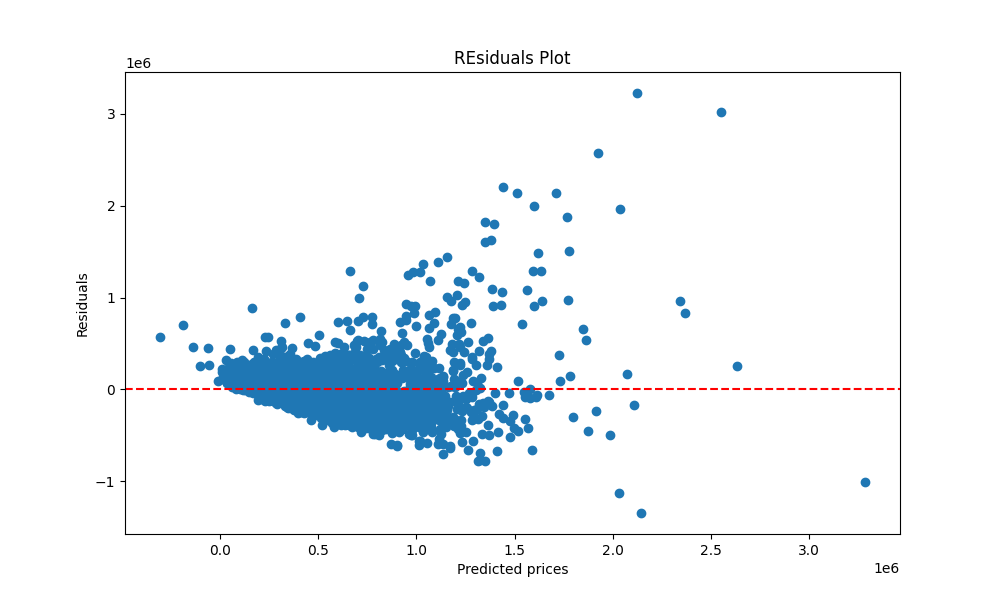
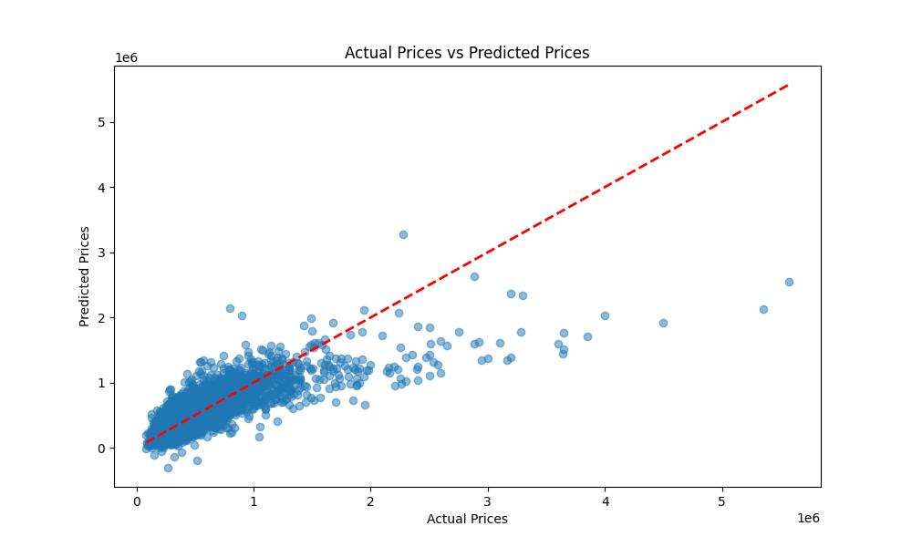
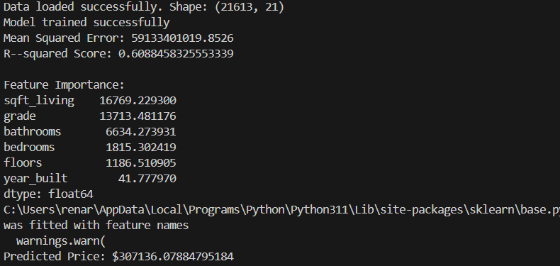
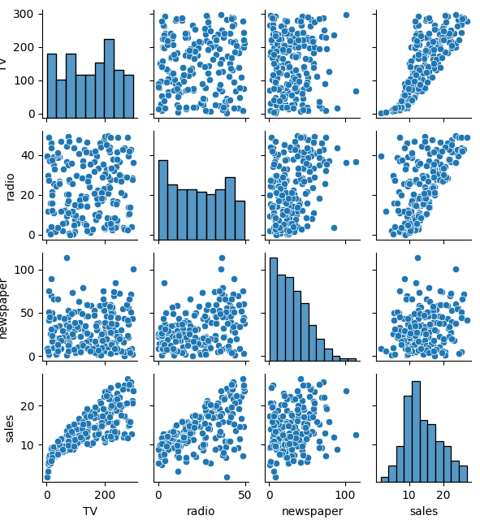
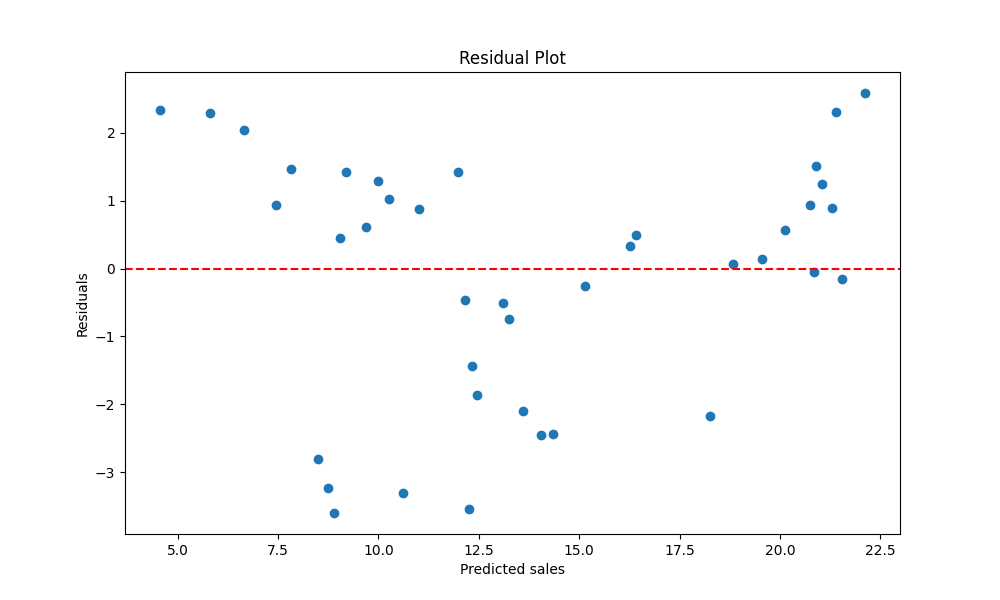
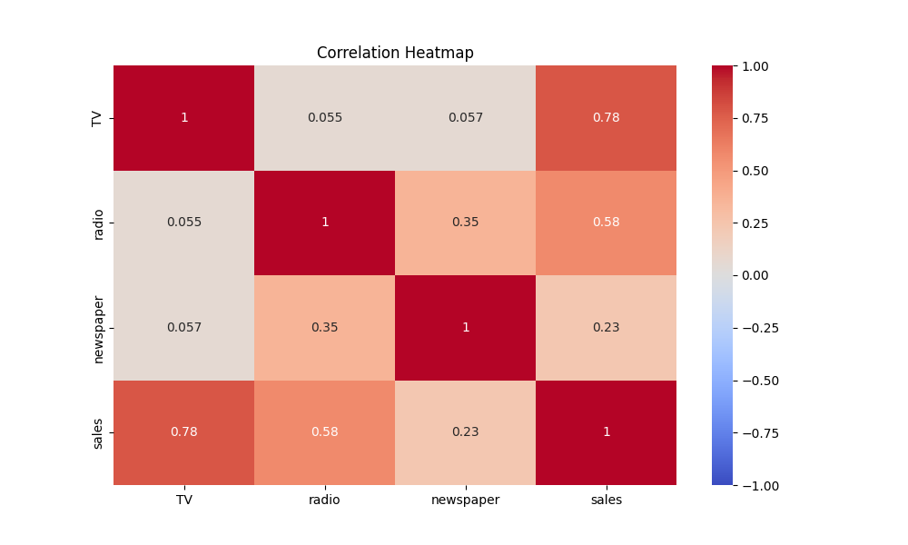
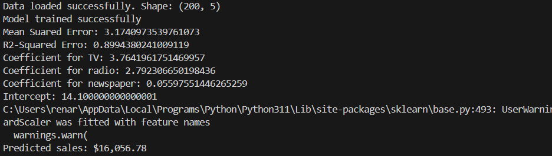

## Here we have two brief examples how to use Python, Scikit Learn and Scipy in multiple linear regression to make a prediction:

## For this first short example we have taken 5 significant features from the real estate market: bedrooms, bathrooms, floors, grade and year of construction.
## We have an almost ready-to-use dataset (taken from Kaggle), we scale its values, trained it and finally evaluate it, let's take a look at it:

**and here We are:**
--------------------

**Let's see our last work...**
---------------------------

## We delve into the advertising market, analyzing the impact on sales across the most influential media. In this work, we also take the Kaggle dataset, scale its values, train the model, evaluate it, and add graphics before running the prediction.

**and here We are:**
--------------------

**Author**
------------

* Renar Zamora - renarzamora@gmail.com

**Tools**
----------------

* Python 3.11, Visual Studio Code, Scikit Learn, Matplotlib, Seaborn, Scipy,Pandas and Numpy